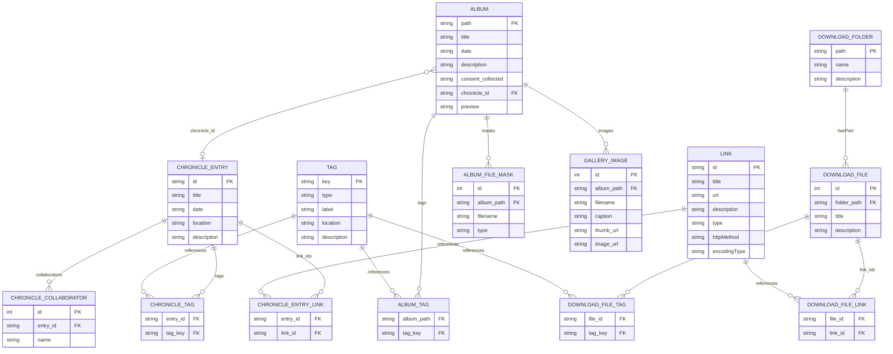

# Datenmodell - Erfindergeist Jülich

Logisches relationales Modell der JSON-basierten Konfigurationsdaten, Galerie-Alben und der Share-API.

## ER-Diagramm



---

## Speicherorte

| Entitat | Datei / Ort | Format |
|---|---|---|
| `CHRONICLE_ENTRY`, `CHRONICLE_COLLABORATOR`, `CHRONICLE_TAG`, `CHRONICLE_ENTRY_LINK` | `share/config/chronicle.json` | JSON-LD `ItemList > Event[]` |
| `TAG` | `share/config/tags.json` | JSON-LD `DefinedTermSet` |
| `LINK` | `share/config/links.json` | JSON-LD `ItemList > ListItem[]` |
| `ALBUM`, `ALBUM_TAG`, `ALBUM_FILE_MASK` | `<SOURCE_DIR>/<path>/_config.json` | JSON, pro Album eine Datei |
| `GALLERY_IMAGE` | `share/galerie/<path>/_meta.json` | JSON-LD `ImageGallery`, generiert |
| `DOWNLOAD_FOLDER`, `DOWNLOAD_FILE`, `DOWNLOAD_FILE_LINK`, `DOWNLOAD_FILE_TAG` | `share/downloads/<path>/_meta.json` | JSON-LD `DataCatalog`, pro Ordner eine Datei |

---

## Datenfluss

```
SOURCE_DIR/<album>/_config.json   share/config/chronicle.json
          |                                    |
          | chronicle_id (FK)                  |
          +------------------------------------+
                      |
               galerie/process.py
                      |
          share/galerie/<album>/_meta.json
          share/galerie/<album>/*_t.webp   (Thumbnails)
          share/galerie/<album>/*_n.webp   (Normalized)
                      |
          share/galerie/_index.json        (Album-Katalog)
                      |
          Share-API  GET /api/v1/assets
```

---

## API-Zugriff (Share)

`GET https://share.erfindergeist.org/api/v1/assets`

Liefert ein einzelnes JSON-LD-Dokument (`DataCatalog`) das u. a. enthalt:

| Abschnitt | Inhalt |
|---|---|
| `config` | Rohinhalt aller Dateien aus `share/config/` inkl. `chronicle.json`, `links.json`, `tags.json` |
| `presentations` | Metadaten der Prasentation-Unterordner |
| `downloads` | `MediaObject`-Eintrge aus `downloads/` inkl. `_meta.json`-Annotationen |

---

## GUI-API (lokaler Config-Editor, Port 8082)

| Methode | Pfad | Entitaten |
|---|---|---|
| `GET /api/all` | Alle drei Config-Dateien auf einmal | `CHRONICLE_ENTRY`, `TAG`, `LINK` |
| `POST /api/save/chronicle` | Chronik schreiben | `CHRONICLE_ENTRY` + Unter-Entitaten |
| `POST /api/save/links` | Links schreiben | `LINK` |
| `POST /api/save/tags` | Tags schreiben | `TAG` |
| `GET /api/log/*` | Anderverlauf (NDJSON) | - |
| `POST /api/undo` | Eintrag wiederherstellen | `CHRONICLE_ENTRY` |
| `GET /api/albums` | Album-Liste | `ALBUM` (Titel + Pfad) |
| `GET /api/album?path=` | Album-Config lesen | `ALBUM` + `ALBUM_TAG` + `ALBUM_FILE_MASK` |
| `POST /api/album?path=` | Album-Config schreiben | `ALBUM` + `ALBUM_TAG` + `ALBUM_FILE_MASK` |
| `GET /api/album/images?path=` | Bilddatei-Liste eines Albums | `GALLERY_IMAGE` (Dateinamen) |
| `GET /api/album/image?path=&file=` | Bilddatei ausliefern | `GALLERY_IMAGE` |
