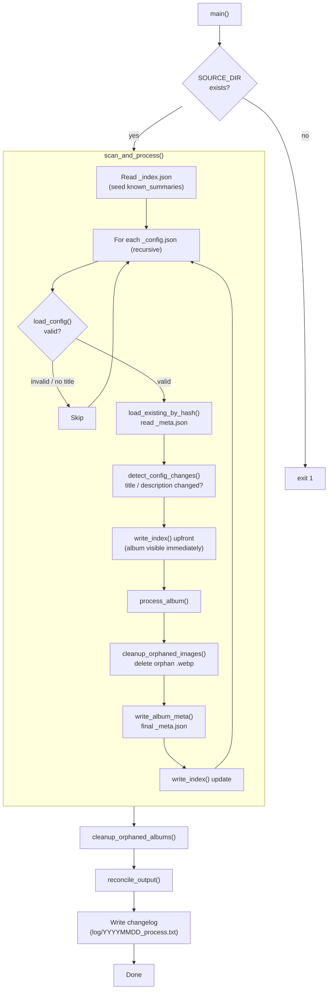
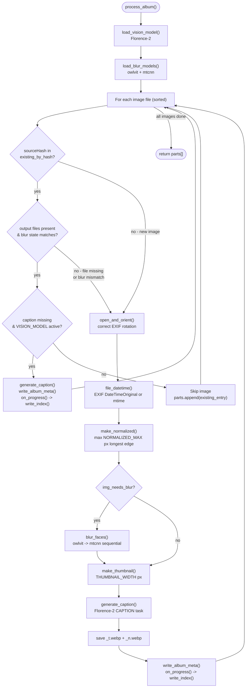

# process.py - Flow Diagram

## Level 1: Overall flow

```mermaid
flowchart TD
    main["main()"]
    check_src{"SOURCE_DIR\nexists?"}
    exit_err["exit 1"]
    scan["scan_and_process()"]
    cleanup_albums["cleanup_orphaned_albums()"]
    reconcile["reconcile_output()"]
    write_log["Write changelog\n(log/YYYYMMDD_process.txt)"]
    done["Done"]

    main --> check_src
    check_src -->|no| exit_err
    check_src -->|yes| scan
    scan --> cleanup_albums
    cleanup_albums --> reconcile
    reconcile --> write_log
    write_log --> done

    subgraph scan["scan_and_process()"]
        direction TB
        seed["Read _index.json\n(seed known_summaries)"]
        foreach_cfg["For each _config.json (recursive)"]
        load_cfg{"load_config()\nvalid?"}
        skip_cfg["Skip"]
        load_existing["load_existing_by_hash()\nread _meta.json"]
        detect_chg["detect_config_changes()\ntitle / description changed?"]
        pre_index["write_index() upfront\n(album visible immediately)"]
        proc_album["process_album()"]
        cleanup_img["cleanup_orphaned_images()\ndelete orphan .webp"]
        write_meta_final["write_album_meta()\nfinal _meta.json"]
        post_index["write_index() update"]

        seed --> foreach_cfg
        foreach_cfg --> load_cfg
        load_cfg -->|invalid / no title| skip_cfg --> foreach_cfg
        load_cfg -->|valid| load_existing --> detect_chg --> pre_index --> proc_album
        proc_album --> cleanup_img --> write_meta_final --> post_index --> foreach_cfg
    end
```

## Level 2: process_album() - image processing

```mermaid
flowchart TD
    start(["process_album()"])
    load_vision["load_vision_model()\nFlorence-2"]
    load_blur["load_blur_models()\nowlvit + mtcnn"]
    foreach_img["For each image file (sorted)"]

    check_existing{"sourceHash in\nexisting_by_hash?"}
    check_files{"output files present\n& blur state matches?"}
    check_cap{"caption missing\n& VISION_MODEL active?"}
    gen_cap_skip["generate_caption()\nwrite_album_meta()\non_progress() -> write_index()"]
    skip_img["Skip image\nparts.append(existing_entry)"]

    open_orient["open_and_orient()\ncorrect EXIF rotation"]
    file_dt["file_datetime()\nEXIF DateTimeOriginal or mtime"]
    make_norm["make_normalized()\nmax NORMALIZED_MAX px longest edge"]
    do_blur{"img_needs_blur?"}
    blur_faces["blur_faces()\nowlvit -> mtcnn sequential"]
    make_thumb["make_thumbnail()\nTHUMBNAIL_WIDTH px"]
    generate["generate_caption()\nFlorence-2 CAPTION task"]
    save_webp["save _t.webp + _n.webp"]
    write_meta_img["write_album_meta()\non_progress() -> write_index()"]
    finish(["return parts[]"])

    start --> load_vision --> load_blur --> foreach_img
    foreach_img --> check_existing
    check_existing -->|yes| check_files
    check_files -->|yes| check_cap
    check_cap -->|yes| gen_cap_skip --> foreach_img
    check_cap -->|no| skip_img --> foreach_img
    check_files -->|no - file missing\nor blur mismatch| open_orient
    check_existing -->|no - new image| open_orient

    open_orient --> file_dt --> make_norm --> do_blur
    do_blur -->|yes| blur_faces --> make_thumb
    do_blur -->|no| make_thumb
    make_thumb --> generate --> save_webp --> write_meta_img --> foreach_img
    foreach_img -->|all images done| finish
```
