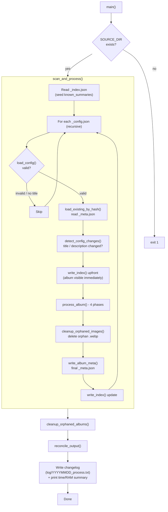
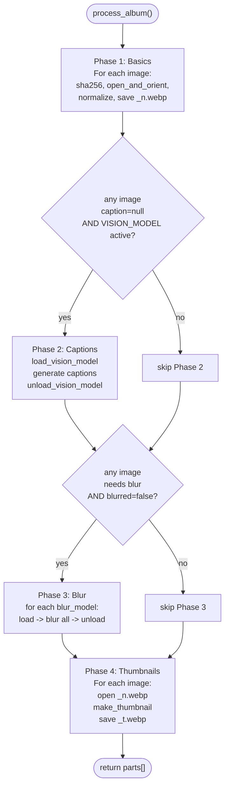
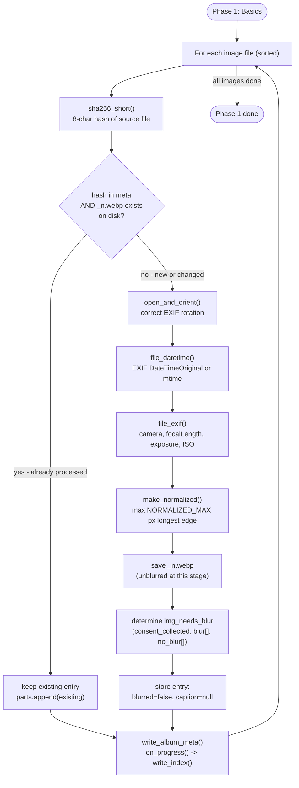
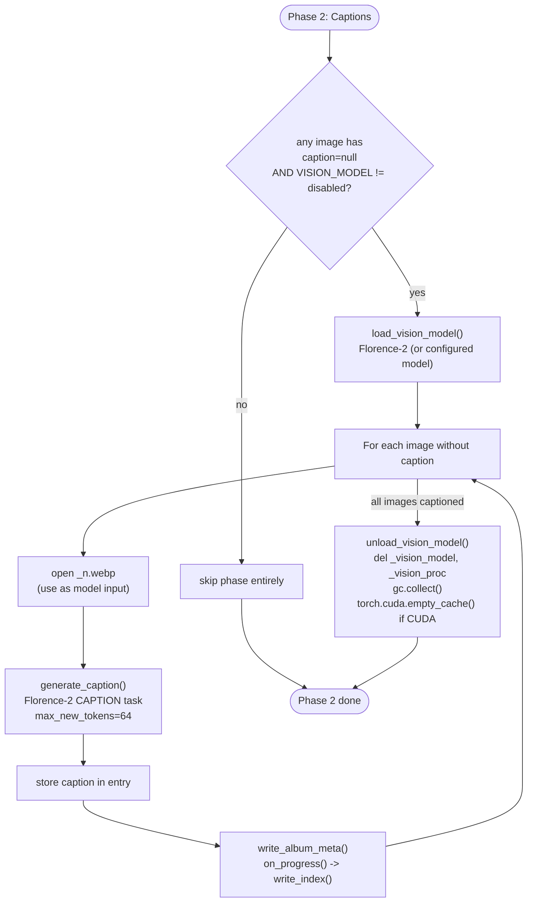
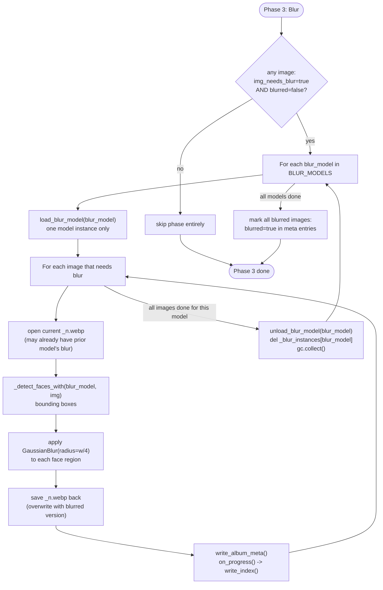
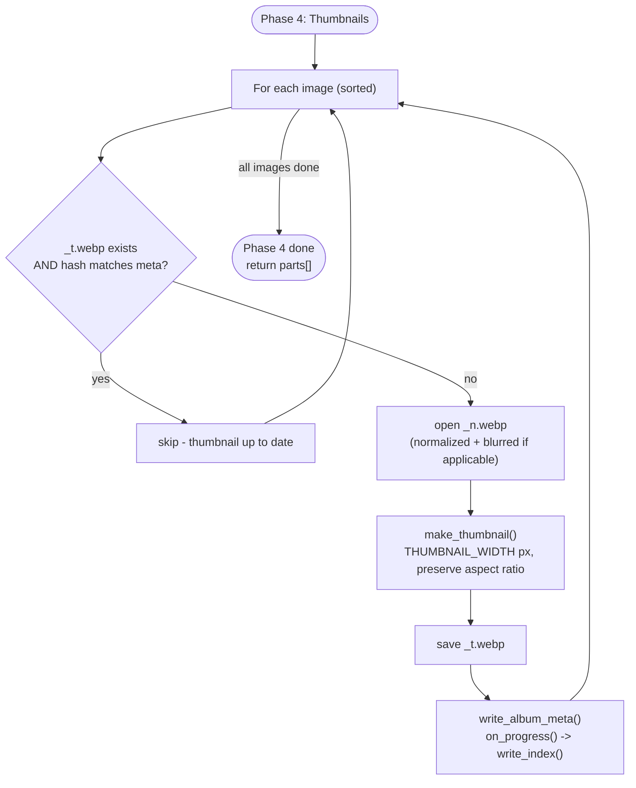

# process.py - New Flow Diagram (4-Phase Architecture)

## Motivation

The original single-pass loop in `process_album()` loads all AI models upfront and keeps them
in RAM simultaneously while processing every image. The new architecture splits the work into
**4 sequential phase-loops**:

1. **Basics** - all images, no AI models
2. **Captions** - load vision model, caption all images needing it, then unload
3. **Blur** - for each blur model: load, blur all images needing it, unload; repeat
4. **Thumbnails** - all images, no AI models

**RAM benefit:** models never overlap in RAM.
Old peak = `vision_model + all_blur_models + Pillow`.
New peak = `max(vision_model, single_blur_model) + Pillow`.

---

## Level 1: Overall flow



---

## Level 2: process_album() - Phase overview



---

## Level 3a: Phase 1 - Basics

No AI models required. Only Pillow and piexif are in RAM.



> `_n.webp` is saved without blur at this point. Phase 3 will overwrite it with the blurred
> version for images that need it.

---

## Level 3b: Phase 2 - Captions

Vision model is loaded once, used for all images missing a caption, then unloaded before
Phase 3 begins. If no image needs a caption the entire phase is skipped.



> Images that already have a caption (from a previous run) are skipped inside the loop.
> The vision model is guaranteed to be unloaded before Phase 3 loads any blur model.

---

## Level 3c: Phase 3 - Blur

One blur model at a time. The outer loop iterates over `BLUR_MODELS`; the inner loop
iterates over all images that need blur. Each model operates on the output of the previous
(iterative blur effect, same as the old single-pass `blur_faces()` behavior).



> `blurred=true` is only written to meta **after** all models have processed the image,
> so a half-finished run (interrupted between models) will re-process cleanly on restart.

---

## Level 3d: Phase 4 - Thumbnails

No AI models required. Thumbnails are derived from `_n.webp` (already normalized and blurred
if needed), not from the original source file.



> Quality note: thumbnail is resized from `_n.webp` (max 1920 px) rather than the original
> source. For a 400 px thumbnail width this makes no visible quality difference.

---

## RAM Profile

| Phase | Active in RAM | Typical peak |
| --- | --- | --- |
| Phase 1 (Basics) | Pillow, piexif | ~150-300 MB |
| Phase 2 (Captions) | Pillow + Florence-2 | ~3-6 GB |
| Phase 3 (Blur, per model) | Pillow + one model | ~300 MB - 2 GB |
| Phase 4 (Thumbnails) | Pillow only | ~150-300 MB |

Old single-pass peak = `Florence-2 + all blur models + Pillow` (all loaded at once).
New peak = `max(Phase 2, Phase 3)` - only one model family resident at a time.

---

## Skip Logic per Phase

Each phase has its own independent skip condition. An image that was already processed in a
previous run will be skipped by the relevant phase, allowing interrupted runs to resume.

| Phase | Skip condition (per image) |
| --- | --- |
| Phase 1 (Basics) | `sourceHash` in meta AND `_n.webp` exists on disk |
| Phase 2 (Captions) | `caption` key already present and non-null in meta entry |
| Phase 3 (Blur) | `blurred: true` already in meta entry OR `img_needs_blur=false` |
| Phase 4 (Thumbnails) | `_t.webp` exists on disk AND `sourceHash` matches meta |

---

## Time & RAM Measurement

### Implementation

```python
import time
import gc
import resource  # Linux only - process runs in container

_t_start: float = time.perf_counter()
_phase_times: dict[str, float] = {}

# Wrap each phase call in process_album():
t0 = time.perf_counter()
_run_phase1_basics(...)
_phase_times["Phase 1 (basics)"] = time.perf_counter() - t0

t0 = time.perf_counter()
_run_phase2_captions(...)
_phase_times["Phase 2 (captions)"] = time.perf_counter() - t0

# ... same for phases 3 and 4 ...

# At the end of main(), before Done:
peak_kb = resource.getrusage(resource.RUSAGE_SELF).ru_maxrss  # KB on Linux
```

`resource.getrusage(resource.RUSAGE_SELF).ru_maxrss` is the lifetime peak RSS of the process
in kilobytes (Linux). It reflects the highest RAM point across all 4 phases - no need to
sample during execution.

### Output format (end of main())

```
=== Process Summary ===
Total time:  12m 34.2s
  Phase 1 (basics):      8m 12.1s
  Phase 2 (captions):    2m 45.3s
  Phase 3 (blur):        1m 31.4s
  Phase 4 (thumbnails):  0m 05.4s
Peak RAM: 4.2 GB
```

Display conversion: `peak_kb / 1024 / 1024` -> GB (show 1 decimal place).
Time format: `int(s // 60)m {s % 60:.1f}s`.
