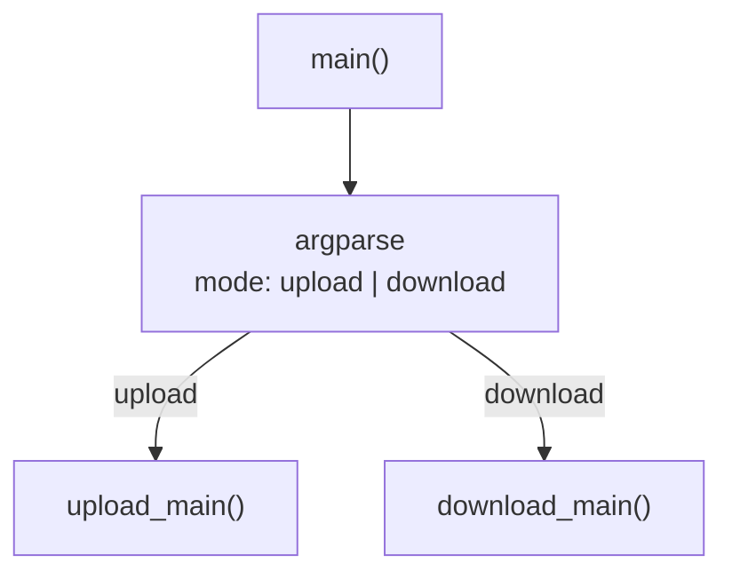
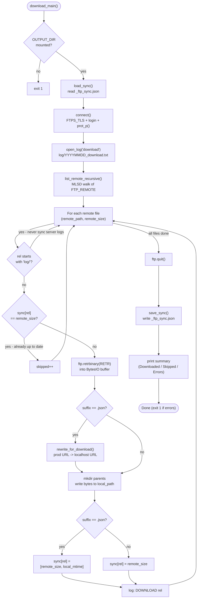
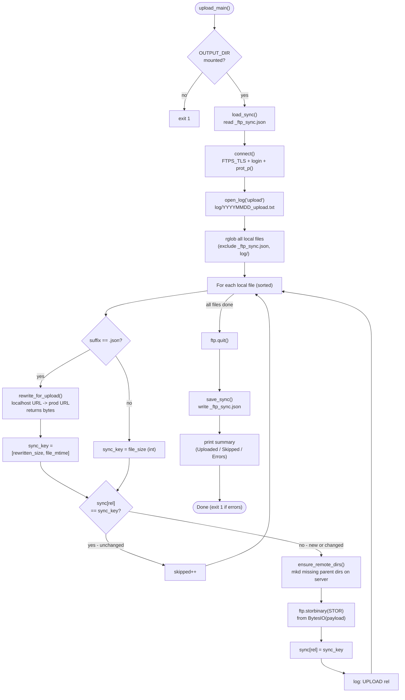

# upload.py - Sync Flow Diagram

Both `upload` and `download` services use the same `upload.py` script, invoked with a mode
argument. A local `_ftp_sync.json` tracks the last known remote state so each run can skip
unchanged files without querying the server per file.

**Typical workflow:**
```
podman compose run --rm download   # 1. fetch current server state
podman compose run --rm process    # 2. generate/update WebP + JSON
podman compose run --rm upload     # 3. push changes to server
```

---

## Level 1: Entry point



---

## Level 2: download_main()

Fetches the current server state into `share/galerie/`. Rewrites production URLs to
localhost URLs in JSON files so the local dev server works without changes.



---

## Level 3: upload_main()

Pushes local `share/galerie/` to the server. Rewrites localhost URLs to production URLs in
JSON files before uploading. Skips files whose sync key has not changed since the last run.



---

## Sync Key Format

`_ftp_sync.json` maps `"relative/path"` to a sync key that lets the next run detect changes
without querying the server:

| File type | sync_key stored | Change detected when |
| --- | --- | --- |
| Binary (`.webp`) | `file_size` (int) | size differs |
| JSON (upload side) | `[rewritten_size, mtime]` | rewritten byte count OR file mtime changed |
| JSON (download side) | `[remote_size, local_mtime]` | remote size differs |

JSON files use two-part keys because URL rewriting can produce the same byte count even when
the content changes (same-length URLs), and because the same file might be re-encoded with
different whitespace. The mtime component catches same-size edits.

---

## URL Rewriting

JSON files (`_meta.json`, `_index.json`) contain absolute URLs for JSON-LD `@id` fields.
Two environments use different base URLs:

| Direction | From | To |
| --- | --- | --- |
| Upload | `http://localhost:8080/galerie` | `https://share.erfindergeist.org/galerie` |
| Download | `https://share.erfindergeist.org/galerie` | `http://localhost:8080/galerie` |

Rewriting is a plain `str.replace` / `bytes.replace` — no JSON parsing required.

---

## Key Functions

| Function | Purpose |
| --- | --- |
| `load_sync()` | Read `_ftp_sync.json`; return `{}` if missing or corrupt |
| `save_sync(sync)` | Write `_ftp_sync.json` (sorted keys for stable diffs) |
| `connect()` | Open `FTP_TLS`, login, `prot_p()` (data channel encryption), binary mode |
| `ensure_remote_dirs(ftp, path)` | Walk parent segments, `mkd` each if missing |
| `list_remote_recursive(ftp, dir)` | Recursive MLSD walk; returns `[(path, size), ...]` |
| `rewrite_for_upload(path)` | Read local file, replace localhost URL, return bytes |
| `rewrite_for_download(data)` | Replace prod URL in bytes, return bytes |
| `open_log(mode)` | Open timestamped log file in `log/` |
